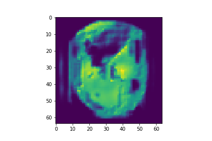
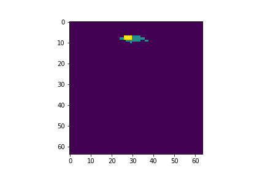
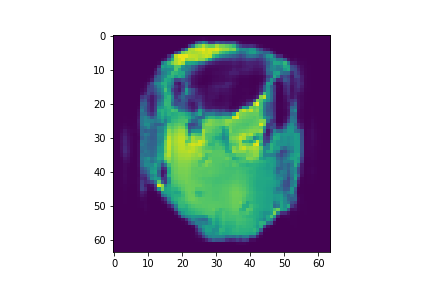
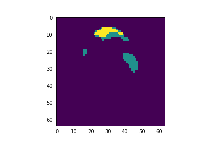
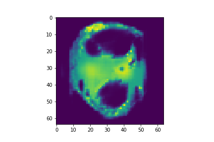
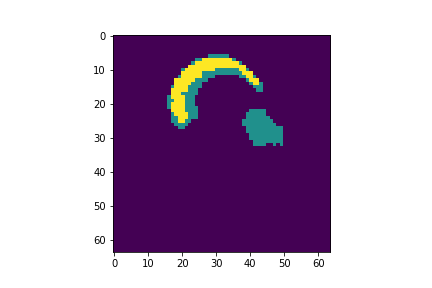

## General Overview
Implemented HDenseUNet for segmentation. Trained using federated learning approach on LITS dataset and tested on 3Ddirac dataset. Augmented using WGAN.

## WGAN Examples

IMage          |  Mask
:-------------------------:|:-------------------------:
  |  
  |  
  |  

## Results

Dice          |  target
:-------------------------:|:-------------------------:
94.6  |  Liver
54  |  Tumor

## References
